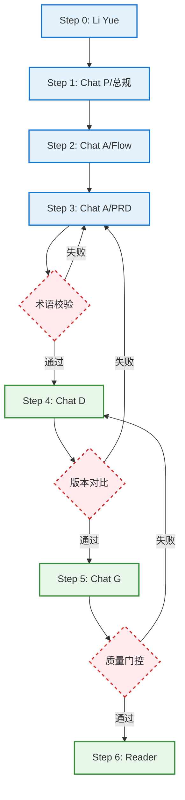

# Antilecai 原型阅读器 & PRD 资产库

> **乐才成果平台 (AI-PRD-Lecai)**：基于行政背书的银发社团社交与"真团购"服务平台。
> 本项目是一站式原型与规格管理工具，整合了**低保真线框图 + 结构化规格 (Spec) + 业务流程图**，支持全链路术语对齐与一键离线打包。

---

> [!CAUTION]
> ## ⛔ Archive 冻结声明（Agent 必读）
>
> `.agents/instructions/achieve/` 目录为**历史废弃归档区**，其中的所有文件均已**停用**，任何 Agent 不得读取、遵守或引用其中的任何规则。
>
> **已冻结归档文件清单**：
> | 文件 | 状态 | 停用原因 |
> | :--- | :--- | :--- |
> | `achieve/elder-expert-liyue-workflow.md` | ❌ 已停用 | 与旧协调员工作流强耦合，逻辑过时 |
> | `achieve/roadmap-planner-coordinator.md` | ❌ 已停用 | 自动化协调机制存在问题，暂停实验 |
> | `achieve/roadmap-planner-flow.md` | ❌ 已停用 | 自动化协调机制关联流程，暂停实验 |
> | `achieve/iteration-execution-pipeline-v2.md` | ❌ 已停用 | 已被 v3 替代，v3 同步停用 |
> | `achieve/iteration-execution-pipeline-v3.md` | ❌ 已停用 | 断点隔离机制仍在优化中，暂停使用 |
>
> **当前替代方案**：李越专家角色请使用 `.agents/instructions/elder-expert-liyue.md`（解耦版）。迭代执行管线以 `README.md` 中的【标准工作流管线】为准。

---

## 📁 目录结构

```
AI-PRD-Lecai/
├── README.md               ← 项目说明
├── .agents/                ← Agent 宪法与技能库
│   ├── instructions/       ← 核心提示词与角色定义
│   │   └── achieve/        ← 已停用的历史指令归档
│   ├── skills/             ← 封装的 Python 自动化脚本
│   └── workflows/          ← 流程指引插件 (如 Low-Fi Flow)
├── foundation/             ← 项目基座（真相来源）
│   ├── roadmap/            ← 业务路线图与迭代拆解
│   ├── design-system/      ← 适老化视觉规范与组件范式
│   ├── Main_PageList.md    ← 全局页面索引（唯一编号源）
│   └── lecai-club-...md    ← 核心业务术语词典
├── drafts/                 ← 活跃研发区（迭代中）
│   ├── v1.3.1/             ← 成员管理与权限
│   └── v1.3.2a/            ← 赛事 A 模式启动
├── releases/               ← 已完成迭代
│   ├── v1.1/               ← 积分系统
│   └── v1.2/               ← 双轨视觉更新
├── achieve/                ← 业务归档（已关闭的规划/旧版）
├── dist/                   ← 打包分发产物 (.html)
└── scripts/                ← 全局构建与维护工具
```

---

## ⚖️ 核心原则 (Core Principles)

### 1. 术语锚定原则 (Terminology Anchor)
项目所有参与者必须遵循：
- **页面命名**：强制对齐 `foundation/Main_PageList.md`，禁止自造编号。
- **业务词汇**：强制对齐 `foundation/lecai-club-overview-v1.4.md`。禁绝"阵地"、"引擎"等文学化表达。

### 2. 线框视觉宪法 (Visual Constitution)
- **极简黑白灰**：禁止使用任何品牌色，依靠灰度 (`bg-gray-200`) 与投影 (`shadow-2xl`) 区分层级。
- **适老化标准**：强制大间距、1px 细线、常规字重，移除所有非核心业务噪音。

### 3. 修订与"无变化"协议 (No-Change Protocol)
- 在执行增量修订时，若模块无变动，ChatG 仅输出"本次无变化"，杜绝幻觉补全。

---

## 🎨 标准工作流管线 (Standard Design Pipeline)

基于实际业务流转复盘，每个迭代（如 `drafts/v1.1`）需严格遵循以下 7 步核心管线。此管线体现了从"宏观总规"到"微观界面"的「自顶向下」设计演进逻辑：

### 🎯 Step 1 — 迭代总规与质量门禁 (Foundation & Quality Gate)
* **强制输入**：当前迭代的业务需求输入件（如 `drafts/v{X.Y}/BRD-draft.md`）
* **角色协作**：产品架构师 `Chat P`（指令文件：`.agents/instructions/chatP-ProductArch-expect.md`）与银发经济审查员 `Li Yue`（指令文件：`.agents/instructions/reviewer-liyue.md`）。
* **业务管线**：
  1. **初稿起草**：Chat P 基于输入的 BRD，输出一份全局视角的迭代整体 PRD 初稿（所有的版本级总规则必须作为独立总纲，不藏在单页面需求里）。
  2. **质量门禁**：Li Yue 对初稿执行适老化体验与业务边界评审，并撰写评审报告。**【严格约束：审查员绝不允许直接修改 Chat P 编写的 PRD 初稿文件，仅允许输出书面的 review 报告】**，随后**挂起等待人类**。
  3. **人工确认**：人类查阅专家报告，介入进行反馈拍板。
  4. **终稿发车**：Chat P 吸收指导意见定稿总纲。**务必在总纲完全定稿后，再去产出迭代的页面边界清单 PageList.md**。同时强约束：**生成清单时，页面名称与编号必须严格以 `foundation/Main_PageList.md` 为唯一基准；若有新增，需遵循现有编号分类顺延，绝对避免冲突**。随后执行指令 `python .agents/skills/lecai-bundler/scripts/bundle.py drafts/v{X.Y} --init` 以预先生成本地的 `reader.html` 预览入口。
* **产出物**（存放于迭代业务目录内）：
  * 迭代宏观架构及总干规则：`master-PRD-v{X.Y}.md`
  * 专属适老与业务审查报告：`review/li-yue-review-v{X.Y}.md`
  * 版本迭代页面结构清单：`PageList.md` (或更新至全局表)
  * 预览入口索引：`reader.html`

### 🎨 Step 1c — UI 风格规格定义 (UI Framing) [暂未启用]
* **任务**：在缺少 UI 设计师的情况下，通过"对标研究"固化视觉风格。对标竞品的视觉基因，并在 `foundation/design-system/` 中格式化沉淀风格规则。
* **产出物**：
  * `foundation/design-system/style-guide/` 中的规则定义
  * `foundation/design-system/ui-patterns/` 中的组件范式定义

### 🔄 Step 2 — 业务全景流程拆解与组装 (Flow)
* **角色**：产品架构师 `Chat P`（指令文件：`.agents/instructions/chatP-ProductArch-expect.md`）
* **任务**：这是一条微型流水线，旨在把业务规则映射为带有"节点价值"的用户旅程：
* **Step 2a (定义框架)**：定义核心流程线及其起点、终点和核心价值。
* **Step 2b (编排节点)**：结合页面编号，定义每条流程的精确跳转动作。**注意：每条独立流程必须单独输出一份 Mermaid 流程图代码（如 `xxx-flow-A.mmd`），禁止将多条流程合并在一个文件中**。
* **Step 2c (视觉渲染)**：调用工作流 `/Low-Fi-Flow-Map-Plugin`，将草图代码渲染为极简 HTML 全景线框图。
* **产出物**：`drafts/v{X.Y}/flow/xxx-flow.html`
### 📝 Step 3 — 页面级功能描述细化 (PRD)
* **角色**：产品重构专家 `Chat A`（指令文件：`.agents/instructions/chatA-ProductMgr-expect.md`）
* **任务**：依据上述流程图的网图定位，对每个涉及的单页面展开**详尽的功能需求与信息结构描述**。
* **产出物**：`drafts/v{X.Y}/prd/{PageID}.md`（如 `PT-1.md`）

### 🖼️ Step 4 — 低保真线框图生成 (Wireframe)
* **角色**：线框工程师 `Chat D`（指令文件：`.agents/instructions/chatD-WireframeDesigner-expect.md`）
* **任务**：将单页面 PRD 翻译为符合极简主义宪法（仅用灰度与阴影层级）的适老化 HTML 网页。
* **产出物**：`drafts/v{X.Y}/wireframe/{PageID}.html`

### ✍️ Step 5 — 开发伴随批注生成 (Annotation)
* **角色**：原型批注专家 `Chat G`（指令文件：`.agents/instructions/chatG-PrototypeReviewer-expect.md`）
* **任务**：剥离界面视觉结构，专注补充底层数据逻辑、接口边界、动效规则、极限值，输出开发专用的结构化 Markdown 说明。
* **产出物**：`drafts/v{X.Y}/annotation/{PageID}.md`

### 📦 Step 6 — 组装原型预览引擎 (Reader Integration)
* **操作**：调用 `lecai-bundler` 技能，通过 `bundle.py` 执行自动化打包。
* **具体指令**：执行命令 `python .agents/skills/lecai-bundler/scripts/bundle.py drafts/v{X.Y}`
* **产出物**：在 `dist/` 目录下生成单文件原型包（如 `Antilecai-drafts-v1.3.1.html`）。

---

## 工作流自动化成熟度视图



### 断点分析与改进建议

| 断点 | 问题描述 | 改进建议 |
|:---|:---|:---|
| **术语校验** | Chat P/A/D/G 需读取 `Main_PageList.md` 进行术语锚定，但无自动校验机制，易产生幻觉 | 增加预检脚本：①检查 foundation 文件完整性 ②术语冲突检测（对比 PRD 中的页面名与字典） |
| **版本对比** | "无变化"识别依赖 Chat G 自行判断，无版本对比机制，易产生假阳性 | 接入 Git diff 或文件哈希校验，明确"变化"定义（文本级 vs 语义级） |
| **质量门控** | 各 Step 输出无自动检查，直接进入下一步 | 增加：①Wireframe HTML 结构验证 ②Annotation 格式校验 ③PRD 完整性检查 |

### 当前可自动化范围

**✅ 现在即可通过自然语言触发**（如 Claude Code）：
```
"基于 drafts/v{X.Y}/prd/{PageID}.md 执行 Step 4-6 流水线"
```

**❌ 仍需人工主导**：
- Step 0-3：涉及战略决策、创造性工作和业务判断

---

每个迭代文件夹的最终物理归档结构应符合以下树形视图：

```text
v{X.Y}/
├── reader.html                     ← Step 1 初始化 & Step 6 最终打包
├── PageList.md                     ← Step 1 产出 (页面清单范围)
├── master-PRD-v{X.Y}.md            ← Step 1 产出 (迭代宏观总规)
├── review/
│   └── li-yue-review-v{X.Y}.md     ← Step 1 产出 (质量门禁报告)
├── flow/                           ← Step 2 产出 (全景流程图)
├── prd/                            ← Step 3 产出 (单页面功能 PRD)
├── wireframe/                      ← Step 4 产出 (低保真线框图)
└── annotation/                     ← Step 5 产出 (开发伴随批注)
```

---

## 💡 V1.2 特色工作流经验 (Best Practices)

在 v1.2 版本的双轨更新中，我们沉淀并验证了以下高效工作流：

- **角色分工协同**：明确使用 **Chat U** 进行高保真 UI 设计与渲染，由 **Chat P** 负责起草产品架构总规，确保"灵魂（架构）"与"皮囊（视觉）"的解耦与高度一致。
- **文案预热包机制**：引入 `drafts/v1.2/kawayi-copy-v1.2.md` 标准演示文案包。在生成全景流程图（Flow Map）时，Agent 强制遵循此文案包进行"杜撰"，极大地节省了后期手动纠偏文案的时间，实现了"逻辑即演示"。
- **主题风格文件化**：通过 `drafts/v1.2/flow-color-theme-v1.2.md` 定义展示流程图的配色风格（如紫色调、蓝色调等）。这使得跨文件的 HTML 流程图在视觉感官上保持高度家族化，且易于全局调整。

---

## 🚀 开发者指南

### 本地预览 (Dev Mode)
```bash
# 启动本地服务
npx -y serve . -l 3000
# 访问设计中的原型 (Drafts)
http://localhost:3000/drafts/v1.1/reader.html
# 访问已发布的版本 (Releases)
http://localhost:3000/releases/v1.0/reader.html
```

---

## 🛠️ 核心生成角色 (Core Agent Roles)

| 角色 | 指令文件 | 核心职责 |
| :--- | :--- | :--- |
| **Chat P (产品架构师)** | `chatP-ProductArch-expect.md` | **V1.0** | Step 1 总规专家。输出版本级业务规则总纲与迭代 PageList，为 Chat A 流程编排提供结构基座。 |
| **Chat A (产品重构专家)** | `chatA-ProductMgr-expect.md` | **V2.3** | 专注于银龄经济，定义产品结构与逻辑，产出纯净、语义化需求描述。 |
| **Chat D (线框工程师)** | `chatD-wireframe-expect.md` | **V1.4** | 将需求转化为 HTML 线框图，具备智能图标推断。 |
| **Chat G (原型批注专家)** | `chatG-Spec-expect.md` | **V2.1** | 原型伴随说明书，Markdown 结构化文档。 |
| **Chat U (UI生成工程师)** | `chatU-UIUEX-expect.md` | **V1.0** | 视觉呈现引擎，强制依据 `variables.css` 将 PRD 翻译为高保真 HTML。 |

---

## 🌟 专项专家与工程助手 (Specialized Experts & Tools)

| 角色/插件 | 路径 | 描述 |
| :--- | :--- | :--- |
| **Li Yue (产品专家)** | `elder-expert-liyue.md` ✅ | **V2.0** | 50-70 岁群体产品架构师。负责 S2B2C 架构规划、荣誉与利益双引擎设计、UI 适老化文案建议。评审输出至 `review/` 目录。 |
| **Li Yue (审查员)** | `reviewer-liyue.md` | **V1.0** | **质量门控（Quality Gate）**。在流水线上执行 0-10 分风险打分制，输出 `[AUTO-PASS]` 或 `[BLOCKED]` 判决，阻断合规风险。 |
| **Git Coach (代码专家)** | `git-migration-coach.md` | 资深开发与版本管理。引导项目安全迁移至 GitHub。 |
| **Low-Fi Flow (全景流程)** | `Low-Fi-Flow-Map-Plugin.md` | 解析 Mermaid 代码，生成 Miro 风格的全景线框流程图。 |

---

## 🔄 进度图 (Project Status)

### v1.0：社团核心逻辑 (Completed)
- [x] **CC-5 (活动详情)**：瀑布流重构与上传补录。
- [x] **CC-6 (作品详情)**：沉浸式阅读区。
- [x] **CC-7 (提交作品)**：单视频/多图排他性发布逻辑。
- [x] **业务流同步**：上传/审核业务流程图更新。

### v1.1：积分系统与个人中心 (Completed)
- [x] **架构规划**：`drafts/v1.1/prd/points-system-v1.1.md` 逻辑锚定。
- [x] **PT-1 (我的积分)**：原型与规格完成。
- [x] **PT-2 (每日签到)**：原型与规格完成。
- [x] **CC-3 (我的导航)**：原型与规格完成。
- [x] **全景流程更新**：完成签到、积分兑换及 1.1 版上传流程映射。
- [x] **Li Yue 评审**：针对积分激励文案的适老化评审。

### 下一步行动指南 (Next Steps)
- [ ] **高保真验证**：选取现有 PRD（如 `drafts/v1.1/prd/PT-2.md` 每日签到），调用新设立的 **Chat U** 配合 `variables.css` 渲染首个全局适老化风格的高保真 HTML 页面。
- [ ] **架构提纯与微调**：根据首个渲染页面的效果，微调 `variables.css` 与 `chatU-prompt-rules.md`。
- [ ] **组件模式沉淀**：后续在验证过程中逐步沉淀出如"适老化通用卡片"、"底部操作栏"放入 `ui-patterns`。

---

> **Tip**: 修改 `.agents/` 下的指令或工作流文件时，务必在 Chat 窗口中执行同步更新，以维持 Agent 认知的实时性。
