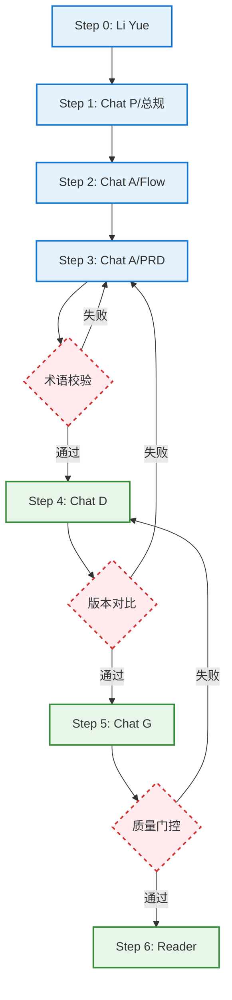

# Antilecai 原型阅读器 & PRD 资产库

> **乐才成果平台 (AI-PRD-Lecai)**：基于行政背书的银发社团社交与"真团购"服务平台。
> 本项目是一站式原型与规格管理工具，整合了**低保真线框图 + 结构化规格 (Spec) + 业务流程图**，支持全链路术语对齐与一键离线打包。

---

## 📁 目录结构

```
AI-PRD-Lecai/
├── README.md               ← 项目说明
├── .agents/                ← Agent 宪法、工作流与本地工具
│   ├── skills/             ← 项目专属自动化工具 (Local Skills)
│   │   ├── lecai-manual/   ← 录屏转 Word 手册工具
│   │   └── lecai-bundler/  ← 原型阅读器单文件打包工具
├── foundation/             ← 项目基座（总 PageList、术语表、路线图、设计系统）
│   ├── design-system/      ← 视觉识别与 UI 设计规范
│   │   ├── benchmarks/     ← 对标研究与视觉逆向工程
│   │   ├── style-guide/    ← 视觉风格指南 (颜色、字体、阴影等)
│   │   ├── ui-patterns/    ← 界面组件模式 (手机端布局风格)
│   │   └── assets/         ← 视觉资产 (图标、Logo)
│   └── roadmap/            ← 产品演进路线图
│       └── Club-match-phase/ ← 社团赛事 (v1.3.2) 规划与策略
├── releases/               ← 已完成迭代（归档只读）
│   └── v1.0/               ← 社团核心逻辑（CC-5/6/7）
├── drafts/                 ← 设计中迭代（活跃工作区）
│   └── v1.1/               ← 积分系统 & 个人中心
├── scripts/                ← 全局打包工具
└── dist/                   ← 分发输出
```

---

## ⚖️ 核心原则 (Core Principles)

### 1. 术语锚定原则 (Terminology Anchor)
项目所有参与者必须遵循：
- **页面命名**：强制对齐 `foundation/Main_PageList.md`，禁止自造编号。
- **业务词汇**：强制对齐 `foundation/lecai-club-overview-v1.4.md`。禁绝"阵地"、"引擎"等文学化表达。

### 2. 线框视觉宪法 (Visual Constitution)
- **极简黑白灰**：禁止使用任何品牌色，依靠灰度 (`bg-gray-200`) 与投影 (`shadow-2xl`) 区分层级。
- **适老化标准**：强制大间距、1px 细线、常规字重，移除所有非核心业务噪音。

### 3. 修订与"无变化"协议 (No-Change Protocol)
- 在执行增量修订时，若模块无变动，ChatG 仅输出"本次无变化"，杜绝幻觉补全。

### 4. 草案隔离原则 (Draft Isolation Rule) 🚨
为了防止未定稿需求的非预期污染，Agent 在执行工作流时必须遵循：
- **禁止自动引用**：除非用户主动要求，否则禁止自动引用非当前迭代目录下的 `drafts/` 资料。
- **合法基准定义**：
    1. **全局基准**：`releases/` 目录下的已发布文件为唯一默认可信源。
    2. **显式例外**：`foundation/Main_PageList.md` 中“现状基准”列指定的路径（即使是 draft）视为用户已确认的合法基准。
    3. **版本上下文**：同一迭代版本目录内（如 `drafts/v1.3.1/`）的不同 Step 产出物允许自动互相引用，以维持设计流水线运转。

---

## 🎨 工作流管线架构 (Workflow Pipelines)

本项目目前并存着经典的单轨流水线，以及为了防污染而全新开辟的**实验中双轨制架构**。

### 🚧 实验中机制：双轨制架构 (Dual-Track Pipelines)
为了彻底解耦“业务规划边界”与“研发交付执行”，并有效规避前期业务沟通阶段中的大模型幻觉，我们当前正引入并测试两套基于实体文档交接的流程架构：

#### 🗺️ 流程 A：产品路线图规划管线 (Roadmap Planner Flow)
* **流程入口**：`.agents/workflows/roadmap-planner-flow.md`
* **配套组件**：`.agents/instructions/roadmap-planner-coordinator.md` (产品规划协调员)
* **核心职责**：定位为克制的业务需求孵化器。限定于 `foundation/roadmap/` 空间内工作，通过写入实体文件的方式将数据交接给专家组件进行评估，并强制利用“断点挂起”机制等待业务干系人跟进反馈。最终产出标准化的 `master-BRD.md` 和带有颗粒化 User Story 的业务切分方案（如 `iteration-X.md`），不直接干预后续研发步骤。

#### 🏭 流程 B：研发自动化交付管线 (V2 Pipeline)
此工作流（.agents\workflows\iteration-execution-pipeline-v3.md ）暂缓使用，待修正

---

### 🏛️ 标准设计发布管线 (Standard Legacy Pipeline)
> **状态变更说明**：自动化工作流（.agents\workflows\standard-design-pipeline.md）暂缓使用

基于早期实际业务流转复盘，若执行单管流，则每个迭代（如 `drafts/v1.1`）需严格遵循以下 7 步。它体现了从"宏观总规"到"微观界面"的「自顶向下」逻辑：

### 🎯 Step 0 — 专家前置审阅 (Review)
* **角色**：业务专项专家（如 `elder-expert-liyue.md`）
* **任务**：从银发经济、S2B2C 视角对迭代计划进行审阅，确认激励差异是否合理、是否存在业务遗漏或合规风险。
* **产出物**：`drafts/v{X.Y}/review/li-yue-review.md`（参考：`.agents/instructions/elder-expert-liyue.md`）

### 🗺️ Step 1 — 迭代宏观规划与总规输出 (Foundation & Scope)
* **角色**：产品架构师 `Chat P`（参考：`.agents/instructions/chatP-ProductArch-expect.md`）
* **任务**：确定本次迭代的宏观规则机制与页面清单边界。所有的**版本级总规则不要藏在单页面的需求里**，需作为独立总纲存在。
* **产出物**（直接存放于迭代根目录或 `foundation/`）：
  * 版本业务规则/说明书（如 `points-system-v1.1.md`）
  * 版本迭代页面清单：`PageList.md` (或更新至根目录总表)
  * 页面流程划分框架：`flow/flow-framework.md`

### 🎨 Step 1c — UI 风格规格定义 (UI Framing)
* **任务**：在缺少 UI 设计师的情况下，通过"对标研究"固化视觉风格。对标竞品的视觉基因，并在 `foundation/design-system/` 中格式化沉淀风格规则。
* **产出物**：
  * `foundation/design-system/style-guide/` 中的规则定义
  * `foundation/design-system/ui-patterns/` 中的组件范式定义

### 🔄 Step 2 — 业务全景流程拆解与组装 (Flow)
这是一条微型流水线，旨在把业务逻辑映射为带有"节点价值"的用户旅程，并强制执行 **Logic Flow-B (流程继承)** 规范：
* **Step 2a (定义框架)**：由 **产品架构师 Chat P** 定义核心流程主链、版本边界及页面编号锚点，确保命名不偏离 `Main_PageList.md`。
* **Step 2b (编排节点)**：：由 **产品架构师 Chat P**细化具体的跳转动作、分支逻辑及提示语。**注意：每条独立流程必须单独输出一份 Mermaid 流程图代码（如 `xxx-flow-A.mmd`）**。
* **Step 2c (视觉渲染)**：：由 **产品架构师 Chat P**调用工作流 `/Low-Fi-Flow-Map-Plugin`，根据 `Main_PageList.md` 中的基准 UI 路径执行物理继承渲染。**注意：禁止在未经授权的情况下跨版本引用其他草案流程图。**
* **产出物**：`drafts/v{X.Y}/flow/xxx-flow.html`（产出过程中需参考 `chatA-ProductMgr-expect.md`）

### 📝 Step 3 — 页面级功能描述细化 (PRD)
* **角色**：产品重构专家 `Chat A`
* **任务**：依据上述流程图的网图定位，对每个涉及的单页面展开**详尽的功能需求与信息结构描述**（参考：`.agents/instructions/chatA-ProductMgr-expect.md`）。
* **继承审计**：必须包含 `[现状规则回顾]` 模块，并严格遵守 **草案隔离原则** 选取基准文件。
* **产出物**：`drafts/v{X.Y}/prd/{PageID}.md`（如 `PT-1.md`）

### 🖼️ Step 4 — 低保真线框图生成 (Wireframe)
* **角色**：线框工程师 `Chat D`（参考：`.agents/instructions/chatD-wireframe-expect.md`）
* **任务**：将单页面 PRD 翻译为符合极简主义宪法（仅用灰度与阴影层级）的适老化 HTML 网页。
* **产出物**：`drafts/v{X.Y}/wireframe/{PageID}.html`

### ✍️ Step 5 — 开发伴随批注生成 (Annotation)
* **角色**：原型批注专家 `Chat G`（参考：`.agents/instructions/chatG-Spec-expect.md`）
* **任务**：剥离界面视觉结构，专注补充底层数据逻辑、接口边界、动效规则、极限值，输出开发专用的结构化 Markdown 说明。
* **产出物**：`drafts/v{X.Y}/annotation/{PageID}.md`

### 📦 Step 6 — 组装离线原型包 (Reader Bundling)
* **角色**：原型打包工具 `lecai-bundler` (参考：`.agents/skills/lecai-bundler/SKILL.md`)
* **任务**：当迭代的所有产出物完成并经过本地预览验证后，执行一键打包。
* **执行指令**：`python .agents/skills/lecai-bundler/scripts/bundle.py drafts/v{X.Y}`
* **产出物**：`dist/Antilecai-v{X.Y}.html` (单文件离线版，**无需 Localhost**，支持 `file://` 直接打开，但需联网加载 CDN)。
* **差异说明**：Step 1 生成的 `reader.html` 供开发中实时预览（需 `localhost`）；Step 6 生成的包供分发共享。

---

## 工作流自动化成熟度视图



### 断点分析与改进建议

| 断点 | 问题描述 | 改进建议 |
|:---|:---|:---|
| **术语校验** | Chat P/A/D/G 需读取 `Main_PageList.md` 进行术语锚定，但无自动校验机制，易产生幻觉 | **已引入命名快照控制：** Step 2a 由 Chat P 强制锚定官方编号，禁止 Chat A 在编排流程时私自定名。 |
| **版本对比** | "无变化"识别依赖 Chat G 自行判断，无版本对比机制，易产生假阳性 | 接入 Git diff 或文件哈希校验，明确"变化"定义（文本级 vs 语义级） |
| **质量门控** | 各 Step 输出无自动检查，直接进入下一步 | 增加：①Wireframe HTML 结构验证 ②Annotation 格式校验 ③PRD 完整性检查 |
| **局部批注与继承** | `annotation/` 仅针对增量进行批注，且原型生成容易回归 | **已建立现状继承与隔离机制：** 1. 强制读取 `Main_PageList.md` 基准路径；2. 执行 **草案隔离原则**，防止非预期污染；3. Chat A/P 必须增加 `[现状规则回顾]`；4. **Logic Flow-B/Wireframe-B：** 流程图与线框图均执行物理继承渲染。 |

### 当前可自动化范围

**✅ 现在即可通过自然语言触发**（如 Claude Code）：
```
"基于 drafts/v{X.Y}/prd/{PageID}.md 执行 Step 4-6 流水线"
```

**❌ 仍需人工主导**：
- Step 0-3：涉及战略决策、创造性工作和业务判断

---

每个迭代文件夹的最终物理归档结构应符合以下树形视图：

```text
v{X.Y}/
├── reader.html                  ← Step 6 产出 (预览引擎)
├── PageList.md                  ← Step 1 产出 (页面清单范围)
├── xxx-system-rules.md (样例)    ← Step 1 产出 (全局业务总规)
├── review/                      ← Step 0 产出
├── flow/                        ← Step 2 产出
├── prd/                         ← Step 3 产出
├── wireframe/                   ← Step 4 产出
└── annotation/                  ← Step 5 产出
```

---

## 💡 V1.2 特色工作流经验 (Best Practices)

在 v1.2 版本的双轨更新中，我们沉淀并验证了以下高效工作流：

- **角色分工协同**：明确使用 **Chat U** 进行高保真 UI 设计与渲染，由 **Chat P** 负责起草产品架构总规，确保"灵魂（架构）"与"皮囊（视觉）"的解耦与高度一致。
- **文案预热包机制**：引入 `drafts/v1.2/kawayi-copy-v1.2.md` 标准演示文案包。在生成全景流程图（Flow Map）时，Agent 强制遵循此文案包进行"杜撰"，极大地节省了后期手动纠偏文案的时间，实现了"逻辑即演示"。
- **主题风格文件化**：通过 `drafts/v1.2/flow-color-theme-v1.2.md` 定义展示流程图的配色风格（如紫色调、蓝色调等）。这使得跨文件的 HTML 流程图在视觉感官上保持高度家族化，且易于全局调整。

---

## 🚀 开发者指南

### 本地预览 (Dev Mode)
> [!NOTE]
> 迭代目录下的 `reader.html` (Step 1 产出) 使用 `fetch` 加载局部数据，受浏览器 CORS 策略限制，**必须通过 HTTP 服务访问**，不能直接双击打开。

```bash
# 1. 启动本地服务 (项目根目录)
npx -y serve . -l 3000

# 2. 访问设计中的原型 (Drafts)
http://localhost:3000/drafts/v1.3.1/reader.html

# 3. 访问已发布的版本 (Releases - 需在该文件夹下有 reader.html)
http://localhost:3000/releases/v1.0/reader.html
```

---

## 🛠️ 核心生成角色 (Core Agent Roles)

| 角色 | 指令文件 | 核心职责 |
| :--- | :--- | :--- |
| **Chat P (产品架构师)** | `chatP-ProductArch-expect.md` | **V1.1** | Step 1 & 2a 专家。定义版本级规则、迭代 PageList 及 **业务流程骨架 (Flow Framework)**，负责核心命名对齐。 |
| **Chat A (产品重构专家)** | `chatA-ProductMgr-expect.md` | **V2.4** | Step 2b & 3 专家。定义交互节点细节，产出纯净需求描述。**执行 Logic Flow-B 继承审核。** |
| **Chat D (线框工程师)** | `chatD-wireframe-expect.md` | **V1.4** | 将需求转化为 HTML 线框图，具备智能图标推断。 |
| **Chat G (原型批注专家)** | `chatG-Spec-expect.md` | **V2.1** | 原型伴随说明书，Markdown 结构化文档。 |
| **Chat U (UI生成工程师)** | `chatU-prompt-rules.md` | **V1.0** | 视觉呈现引擎，强制依据 `variables.css` 将 PRD 翻译为高保真 HTML。 |

---

## 🌟 专项专家与工程助手 (Specialized Experts & Tools)

### 1. 专家与插件 (Experts & Plugins)

| 名称 | 路径 | 描述 |
| :--- | :--- | :--- |
| **Li Yue (银发专家)** | `elder-expert-liyue.md` | 50-70 岁群体产品架构师。负责 S2B2C 架构规划、荣誉与利益双引擎设计。 |
| **Li Yue (审查分身)** | `reviewer-liyue.md` | 在流水线上充当质量门控（Quality Gate），严格执行 0-10 分的风险阻断。 |
| **Git Coach (代码专家)** | `git-migration-coach.md` | 资深开发与版本管理。引导项目安全迁移至 GitHub。 |
| **Low-Fi Flow (流程图)** | `Low-Fi-Flow-Map-Plugin.md` | 解析 Mermaid 代码，生成 Miro 风格的全景线框流程图。 |

### 2. 项目专属本地工具 (Local Skills)

| 工具名称 | 触发指令 | 核心职责 |
| :--- | :--- | :--- |
| **lecai-manual** | `/lecai-manual` | **录屏转手册**：解析操作视频与字幕，自动生成适老化的 Word 产品手册（大字号、动作导向、友好名称）。 |
| **lecai-bundler** | `/lecai-bundler` | **单文件打包**：将指定版本（如 `drafts/v1.3.1`）的线框图、功能规格、流程图打包为单个可分享的 HTML 文件。 |

---

## 🔄 进度图 (Project Status)

### v1.0：社团核心逻辑 (Completed)
- [x] **CC-5 (活动详情)**：瀑布流重构与上传补录。
- [x] **CC-6 (作品详情)**：沉浸式阅读区。
- [x] **CC-7 (提交作品)**：单视频/多图排他性发布逻辑。
- [x] **业务流同步**：上传/审核业务流程图更新。

### v1.1：积分系统与个人中心 (Completed)
- [x] **架构规划**：`drafts/v1.1/prd/points-system-v1.1.md` 逻辑锚定。
- [x] **PT-1 (我的积分)**：原型与规格完成。
- [x] **PT-2 (每日签到)**：原型与规格完成。
- [x] **CC-3 (我的导航)**：原型与规格完成。
- [x] **全景流程更新**：完成签到、积分兑换及 1.1 版上传流程映射。
- [x] **Li Yue 评审**：针对积分激励文案的适老化评审。

### v1.3.2：社团赛事 - B模式 (Roadmap)
- [ ] **业务目标 (BRD)**：[社团赛事BRD](file:///d:/AntiGravity/AI-PRD-Lecai/foundation/roadmap/Club-match-phase/clube-match-BRD-draft.md) 核心逻辑确认。
- [ ] **迭代策略 (Phasing)**：[分期策略 v1.3.2](file:///d:/AntiGravity/AI-PRD-Lecai/foundation/roadmap/Club-match-phase/iteration-phasing-strategy-v1.3.2.md) 采取“敏捷验证 -> 自动提效”双阶段策略。
- [ ] **v1.3.2a (C端闭环)**：聚焦“入社参赛”强卡点、荣誉闭环与后台代建试点。
- [ ] **v1.3.2b (团长赋能)**：实现团长端自助创赛与“一键办赛”模板库。

### 下一步行动指南 (Next Steps)
- [ ] **高保真验证**：选取现有 PRD（如 `drafts/v1.1/prd/PT-2.md` 每日签到），调用新设立的 **Chat U** 配合 `variables.css` 渲染首个全局适老化风格的高保真 HTML 页面。
- [ ] **架构提纯与微调**：根据首个渲染页面的效果，微调 `variables.css` 与 `chatU-prompt-rules.md`。
- [ ] **组件模式沉淀**：后续在验证过程中逐步沉淀出如"适老化通用卡片"、"底部操作栏"放入 `ui-patterns`。

---

> **Tip**: 修改 `.agents/` 下的指令或工作流文件时，务必在 Chat 窗口中执行同步更新，以维持 Agent 认知的实时性。
