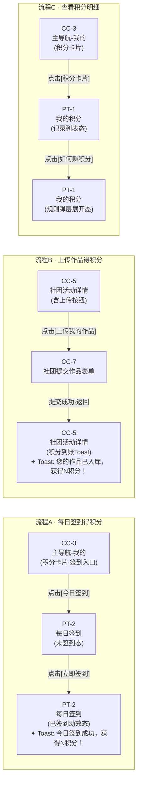

# 流程框架定义 · 积分体系 v1.1

> **文档性质**：Step 2a 产出物原文存档 · 指导 flow 产出范围与拆解方式
> **来源角色**：li-yue-expert
> **依据文档**：`doc/points-system-v1.1.md`
> **关联产出**：`v1.1/flow/points-flow-v1.1.html`

---

## 一、原文（Step 2a · 业务流程框架定义）

本次迭代核心是"积分"这个利益引擎的首次落地，涉及两类角色（普通成员 / 社团主）、三条核心用户旅程：

**流程 A：每日签到得积分（普通成员日活旅程）**
* 业务起点：用户打开 App / 返回「我的」页
* 业务终点：签到成功，积分到账，感受到"今天打卡了"的仪式感
* 核心价值：驱动日活；让用户每天有理由打开 App

**流程 B：上传作品得积分（内容创作激励旅程）**
* 业务起点：用户进入某社团的某个活动
* 业务终点：作品发布成功，积分到账，用户确信"我的作品有价值"
* 核心价值：核心行为激励；打通"内容创作 → 实物回报"信任链路

**流程 C：查看积分明细（积分感知旅程）**
* 业务起点：用户在「我的」页看到积分卡片，被余额数字吸引
* 业务终点：在 PT-1 查看完整记录，点开「如何赚积分」了解规则，产生"我还可以这样赚"的行动意图
* 核心价值：强化积分的"存在感"；把已有行为与积分连接起来，让用户感知到自己的累积价值

这三条流程是互相递进的：A 是每日触发、B 是深度参与、C 是认知强化。三者共同构成 Phase 1 积分体系的完整用户体验闭环。

---

## 二、流程总览

| 流程编号 | 流程名称 | 用户角色 | 核心规则 | 产出状态 |
|:--|:--|:--|:--|:--|
| Flow A | 每日签到得积分 | 普通成员 | R1 | ✅ 已产出 |
| Flow B | 上传作品得积分 | 普通成员 | R2 / R3 | ✅ 已产出 |
| Flow C | 查看积分明细 | 普通成员 | PT-1 / PT-2 查看入口 | ✅ 已产出 |

> **范围说明**：Step 2a 定义的交付范围为上述 3 条流程，合并产出于 `points-flow-v1.1.html`。R6–R11（社团主相关积分触发）不在本次 flow 交付范围内。

---

## 三、各流程页面节点

### Flow A · 每日签到得积分

```
CC-3（积分卡片 · 签到入口）
    → 点击[今日签到]
    → PT-2 每日签到（未签到态）
        → 点击[立即签到]
        → PT-2（已签到动效态）· 积分到账 Toast：「今日签到成功，获得 N 积分！」
```

**涉及页面**：CC-3、PT-2

---

### Flow B · 上传作品得积分

```
CC-5 社团活动详情（含上传入口）
    → 点击[上传我的作品]
    → CC-7 社团提交作品表单
        → 填写并提交
        → CC-5（返回态）· 积分到账 Toast：「您的作品已入库，获得 N 积分！」
```

**涉及页面**：CC-5、CC-7

---

### Flow C · 查看积分明细

```
CC-3（积分卡片）
    → 点击[积分卡片]
    → PT-1 我的积分（记录列表态）
        → 点击[如何赚积分]
        → PT-1（规则弹层展开态）
```

**涉及页面**：CC-3、PT-1

---

## 四、Mermaid 原始中间产出（Chat A → Chat D 移交物）

> **说明**：此 Mermaid 为 Chat A 在 Step 2a 产出后、移交 Chat D 渲染前的中间产物，原文仅存于对话流，此处为逆向还原版本。



---

## 五、对比核查：HTML 产出与流程定义一致性

| 检查项 | 定义 | HTML 产出 | 结论 |
|:--|:--|:--|:--|
| Flow A 节点数 | 3 个（CC-3 / PT-2未签到 / PT-2已签到） | 3 个，标签一致 | ✅ |
| Flow A Toast 文案 | 「今日签到成功，获得 N 积分！」 | `今日签到成功，获得 3 积分！` | ✅ |
| Flow B 起点 | CC-5 社团活动详情 | CC-5（含上传按钮）| ✅ |
| Flow B Toast 落点 | 上传成功后返回 CC-5 | CC-5（积分到账Toast）| ✅ |
| Flow B Toast 文案 | 「您的作品已入库，获得 N 积分！」 | `您的作品已入库，获得 10 积分！` | ✅ |
| Flow C 终点 | PT-1 规则弹层展开态 | PT-1（规则弹层）| ✅ |
| 三流程整合 | 合并在同一文件 | `points-flow-v1.1.html` | ✅ |
