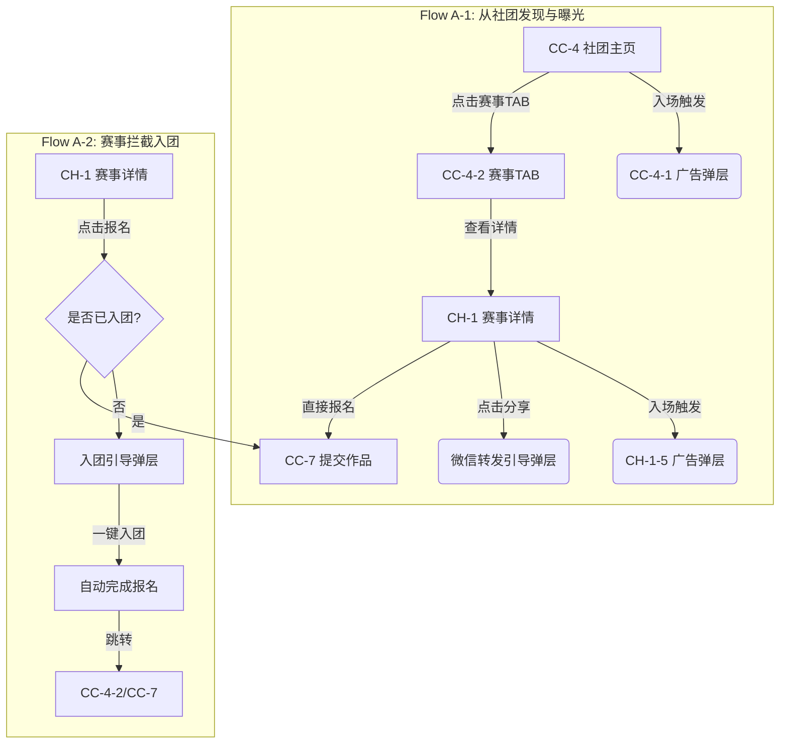
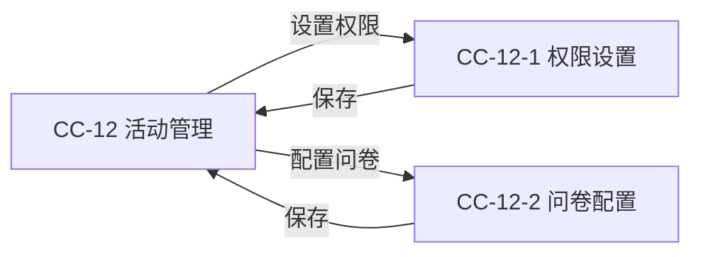

# v1.2 流程框架定义

> **迭代主题**：社团能力升级——社团赛事 + 认证工具套件
> **文档性质**：Step 2a 产出物原文存档 · 指导 flow 产出范围与拆解方式
> **依据文档**：`drafts/v1.2/club-upgrade-v1.2.md`
> **核心原则**：不搭建重量级独立模块；在现有社团/赛事框架上最小化扩展；每个流程独立成图

---

## 一、核心设计决策

### 决策 1：作品提交是核心，认证是结果
所有功能围绕「上传作品 → 平台认证/奖励兑换」的平台核心逻辑展开。认证不是独立的重量级模块，是作品提交完成后的自然结果。

| 原始业务概念 | 平台实现方式 |
|---|---|
| 师训培训内容 | 社团活动（CC-5）下挂载课程资料区块，外链跳转 |
| 学员提交培训成果 | 直接复用 CC-7 作品提交，新增「认证」标签分类 |
| 认证考核 | 轻量问卷（CC-23，≤5 题）作为辅助，主要依据是作品 |
| 认证证书 | 复用现有赛事证书弹层机制（CH-2-2），挂载于 CC-6 |

### 决策 2：三个工具长在社团下，无独立入口
培训资料、作品提交、认证证书三个工具均附属于社团活动（CC-5/CC-6/CC-7），不在平台主导航新增任何入口。对用户而言，操作路径与使用普通社团功能一致。

### 决策 3：不新建认证证书独立页
证书展示复用赛事模块已有的证书弹层机制（CH-2-2），在 CC-6 社团作品详情页触发。原规划中的 CC-24 独立证书页**取消**。

---

## 二、流程总览

| 流程编号 | 流程名称 | 用户角色 | 核心逻辑 | 产出状态 |
|:---|:---|:---|:---|:---|
| **Flow A-1** | 从社团发现赛事 | 普通成员 (C) | 社团主页 TAB 发现关联赛事 | 🚧 设计中 |
| **Flow A-2** | 从赛事发现并加入社团报名 | 普通用户 (C) | 报名拦截引导加入社团 | 🚧 设计中 |
| **Flow B** | 活动权限配置 | 社团主 (Small B) | 权限设置 (CC-12-1) + 问卷配置 (CC-12-2) | 🚧 设计中 |
| **Flow C-1** | 发布培训内容 | Big B/社团主 | 创建活动 + 挂载资料与问卷 | 🚧 设计中 |
| **Flow C-2** | 学员提交认证内容 | 认证老师 (C) | 提交作品 (CC-7) + 录入心得 (CC-23) | 🚧 设计中 |
| **Flow C-3** | 认证通过 | 认证老师 (C) | 外部评审写入 -> 通知 -> 证书弹层 | 🚧 设计中 |

---

## 三、各流程页面节点定义

### Flow A-1 · 从社团发现赛事
**场景**：用户已是社团成员，通过社团主页直接发现并参与关联赛事。同时涉及进入页面的广告曝光。
```
CC-4 社团主页 (内置淡紫色广告Banner)
  → 入场触发 CC-4-1 社团主页-广告弹层
  → 点击 [赛事] TAB
  → CC-4-2 社团主页-赛事TAB
  → 点击 [赛事卡片]
  → CH-1 赛事详情页 (内置淡紫色广告Banner)
  → 入场触发 CH-1-5 赛事详情-广告弹层
  → (分支1) 点击 [分享] -> 引出模拟微信转发弹层
  → (分支2) 点击 [参赛报名]
  → CC-7 社团提交作品表单（参赛模式）
```

### Flow A-2 · 从赛事发现并加入社团报名
**场景**：外部流量进入赛事页，非关联社团成员，需先入团。
```
CH-1 赛事详情页
  → 点击 [参赛报名]
  → 触发 [一键入团引导弹层]
  → 点击 [确定入团]
  → 提示 [入团成功，已为您同步报名]
  → [可选] 查看 [CC-4-2 赛事列表]
```

### Flow B · 活动权限配置
**场景**：社团主设置活动的可访问范围及配套问卷。
```
CC-12 社团活动管理
  → 设置 [活动可见权限]
  → CC-12-1 活动权限设置（公开 / 仅成员）
  → 设置 [活动挂载问卷]
  → CC-12-2 活动问卷配置（开启/关闭心得回顾）
```

### Flow C-1 · 发布培训内容
**场景**：Big B 在社团内发布带有认证属性的培训课程。
```
[Big B] 进入管理端
  → 创建社团活动 (CC-12)
  → 输入培训资料外链 (CC-5 展示位)
  → 进入 CC-12-1 设为「仅成员可见」
  → 进入 CC-12-2 开启「教学心得回顾」
  → 发布成功
```

### Flow C-2 · 学员提交认证内容
**场景**：受训老师完成学习，提交作品并发起认证。
```
CC-5 社团活动详情
  → 点击 [上传我的作品]
  → CC-7 社团提交作品表单 (勾选「认证提交」)
  → 提交成功 -> 自动跳转 -> CC-23 教学心得问卷
  → 填写并提交心得
  → 完成，等待评审 (CC-5 状态更新)
```

### Flow C-3 · 认证通过
**场景**：外部评审完成后，用户获得荣誉证书。
```
[外部节点: 卡哇伊后台评审并通过]
  → [通知写入: 乐才平台更新认证状态]
  → 推送 [系统通知] 给用户
  → 用户点击通知 -> CC-6 社团作品详情
  → 自动触发 [CH-2-2 证书弹层]
  → 点击 [分享] 生成海报
```

---

## 四、Mermaid 流程图代码

### Flow A (社团赛事路径)


### Flow B (权限配置)


### Flow C (师训认证全链路)

```mermaid
graph TD
    subgraph C1 ["C-1: 发布培训内容"]
        P1[Big B 管理端] -->|创建活动 CC-12| P2[配置资料外链 & CC-12-1/2]
        P2 --> P3[CC-5 培训活动页]
    end

    subgraph C2 ["C-2: 学员提交认证"]
        S1[CC-5 培训活动] -->|点击上传| S2[CC-7 提交作品]
        S2 -->|提交| S3[CC-23 教学心得回顾]
        S3 -->|提交| S4[等待评审状态]
    end

    subgraph C3 ["C-3: 认证通过"]
        R1([外部评审节点: 卡哇伊后台]) -->|结果写入| R2[平台认证状态更新]
        R2 -->|系统通知| R3[CC-3/CC-6]
        R3 -->|触发| R4[CH-2-2 证书弹层]
    end
```

