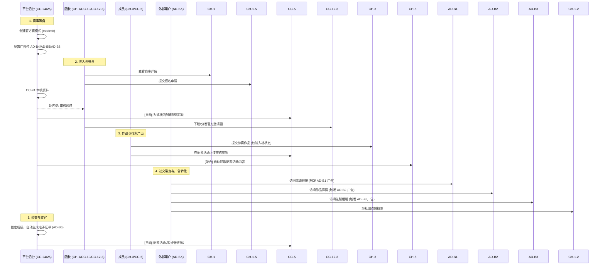
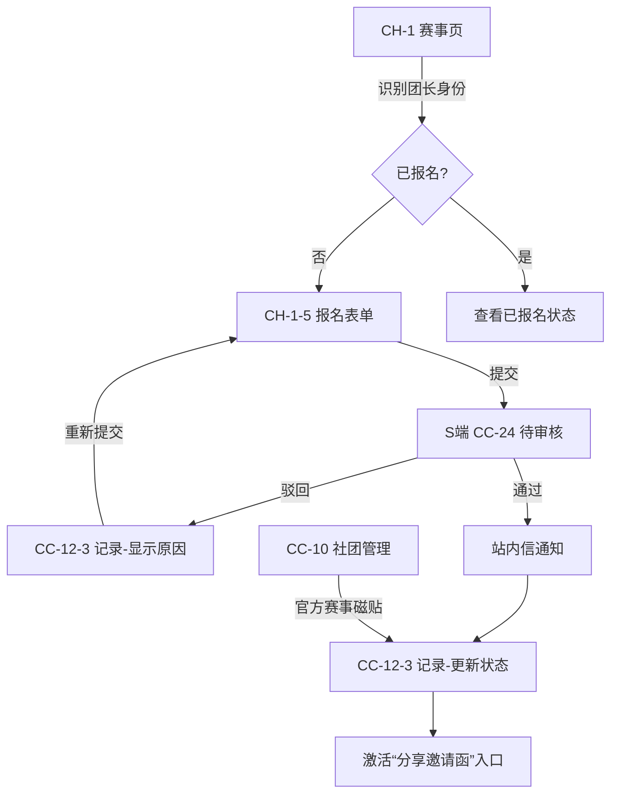
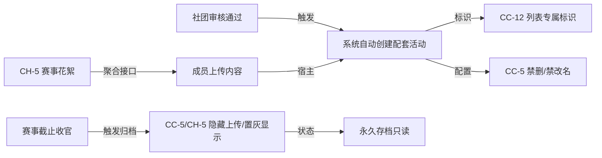
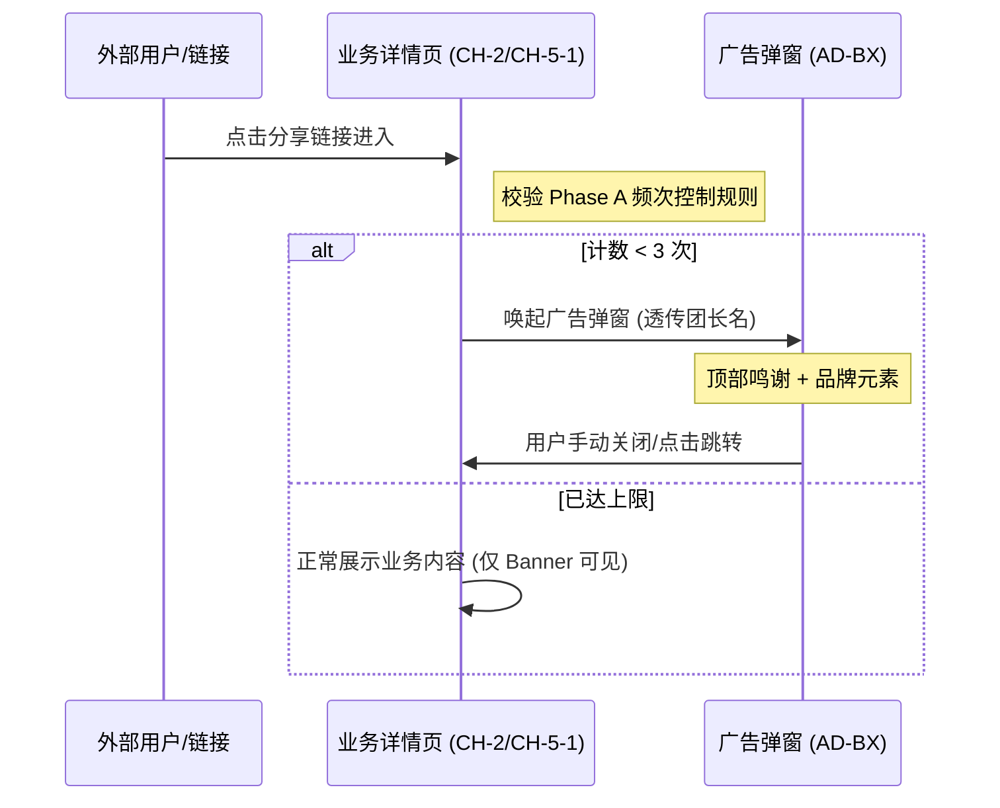

# V1.4 官方荣耀赛 核心业务流程框架

本文件定义了 V1.4 迭代中 S2B2C 链路的核心业务流转逻辑，旨在明确各角色（平台、团长、成员、外部用户）在赛事全生命周期中的交互边界。

## 1. 业务角色定义
- **S 端 (Admin)**: 平台运营人员，负责创建赛事、审核社团资料、配置商业广告及颁发荣誉。
- **B 端 (Leader)**: 社团团长，负责代表社团报名、分发邀请函、管理内部花絮相册权限。
- **C 端 (Member)**: 社团正式成员，负责投稿、上传花絮、参与人气投票。
- **E 端 (External)**: 外部亲友及受邀用户，负责访问落地页、浏览作品/花絮、为社团点赞。

---

## 2. 核心业务全链路 (S2B2C Lifecycle)

---

## 3. 重点流程拆解

### 3.1 社团报名与记录管理流 (Leader Focus)
该流程明确了团长如何从零开始参与赛事，并管理其报名痕迹。

### 3.2 赛事花絮生命周期流 (Highlights Management)
强调“自动创建”与“强制归档”的宿主与客体关系。

### 3.3 广告触达触发逻辑 (Ad Timing)
定义 AD-B1/AD-B2/AD-B3 独立页面的唤起时机。

---

## 4. 流程设计要点总结
1. **零成本参与**: 成员上传花絮无需感知“关联”操作，通过配套活动 ID 自动实现 S2B 聚合。
2. **行政权威感**: 报名流从 CH-1 发起，由 CC-10 汇总记录，强化官方赛事的特殊地位（非普通活动）。
3. **商业克制**: 严格执行“跨广告位合并计次 (max=3)”规则，保护用户体验。
