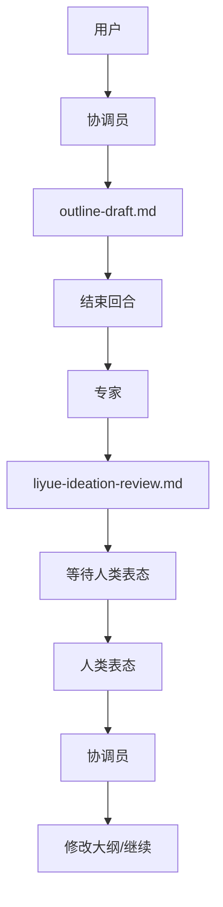

# 多 Agent 角色切换改造 · 快速实施手册

## 改造核心：单回合切换 → 文件交接 + 断点

---

## Step 1: 修改协调员 Prompt
**文件：** `.agents/instructions/roadmap-planner-coordinator.md`

**删除：** 所有“附体专家”、“切换人格”相关逻辑。

**新增内容：**
```markdown
## Stage 2: 专家审查（文件交接 + 断点）

1. 将初步大纲输出至 `drafts/vX.Y/outline-draft.md`
2. 回复：“已整理大纲，正在呼叫 @elder-expert-liyue 审阅”
3. 结束当前回合（不要等待回复）
4. 下回合被唤醒后，读取专家批注 + 用户表态，继续下一步

⚠️ 禁止：在单回合内模拟专家人格
✅ 必须：通过文件交接，让专家独立运行
```

---

## Step 2: 修改专家 Prompt
**文件：** `.agents/instructions/elder-expert-liyue.md`

**新增内容：**
### 输入
- `drafts/vX.Y/outline-draft.md`

### 输出
- 必须输出至独立文件：`drafts/vX.Y/review/liyue-ideation-review.md`

### 批注格式
```markdown
# 李越审阅意见 · vX.Y

## ✅ 认可的点
- [...]

## ❌ 尖锐批评
- [问题] + [原因]

## ⚠️ 风险预警
- [...]

## 📋 修改建议
- [...]
```

### 执行后动作
回复：“@elder-expert-liyue 审阅完成，批注已存档。请团长表态（如：'同意第 1、3 点'）”
然后挂起，等待人类表态。

⚠️ 禁止：替协调员提问
✅ 必须：独立输出，等待人类确认

---

## Step 3: 新增状态跟踪文件
**文件：** `.agents/STATE.md`

**内容模板：**
```markdown
# 工作流状态 · vX.Y

| 阶段 | 执行者 | 状态 | 输入 | 输出 |
|------|--------|------|------|------|
| Stage 1 | 协调员 | ✅ 完成 | 用户对话 | outline-draft.md |
| Stage 2 | 专家 | ⏳ 进行中 | outline-draft.md | liyue-ideation-review.md |
| Stage 3 | 人类 | ⏸️ 等待 | 专家批注 | 用户表态 |
| Stage 4 | 协调员 | ⏳ 待执行 | 批注 + 表态 | 修改后大纲 |

**当前阶段：** Stage 2
**下一步：** 专家输出 → 人类表态 → 协调员收拢
```

---

## Step 4: 目录结构
```text
.agents/
├── instructions/
│   ├── roadmap-planner-coordinator.md  # 已改造
│   └── elder-expert-liyue.md           # 已改造
├── STATE.md                            # 新增
└── ...
drafts/
└── vX.Y/
    ├── outline-draft.md
    └── review/
        └── liyue-ideation-review.md    # 新增
```

---

## 验收标准（改造后验证）

| 检查项 | 预期 | 验证方法 |
| :--- | :--- | :--- |
| **协调员不模拟专家** | ✅ | 检查协调员回复，无角色扮演迹象 |
| **专家独立运行** | ✅ | 检查专家回复，独立完成逻辑 |
| **文件交接清晰** | ✅ | 检查 `drafts/` 目录下是否有对应文件生成 |
| **人机断点明确** | ✅ | 专家输出后等待人类表态，不自动推进 |
| **状态可追溯** | ✅ | 检查 `STATE.md` 是否实时更新 |

---

## 流程图


**预计耗时：** 20 分钟
**风险：** 无（纯文本修改，可回滚）
